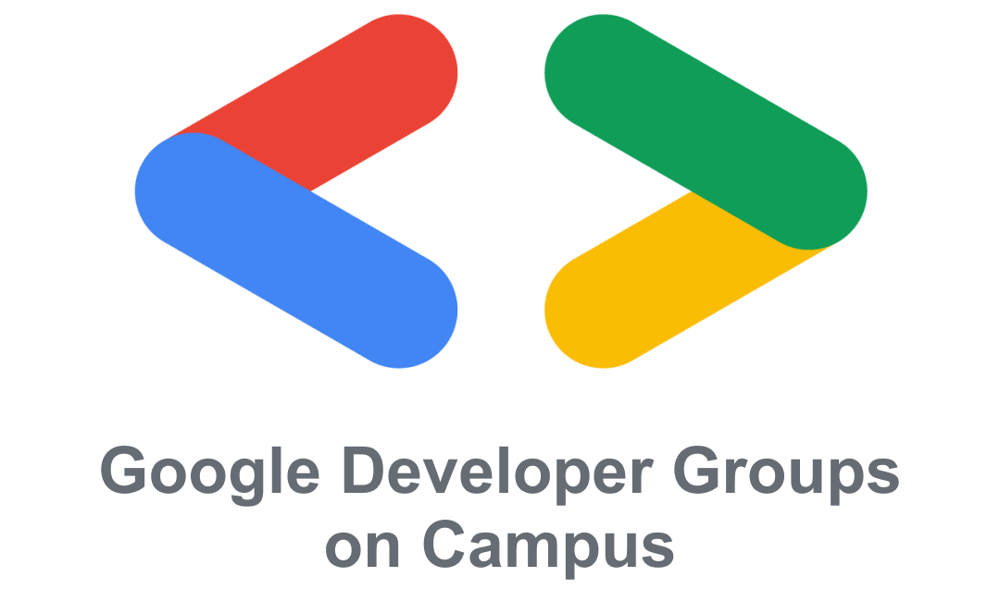

# GDGoC_Beginner_Team1

<div align = "center">



</div>

---

## 배포 주소 | Distribution Address

- [바로 가기](https://)

---

## 프로젝트 소개 | Introducion to the Project

```
GDGoC 7기 비기너 1팀의 최종 프로젝트 레포지토리입니다.
GDGoC 스터디 홍보 게시판 입니다.
```
> 개발 기간 : 2026.01 ~ 2026.02

---

## 시작 가이드 | Getting start

### 1️⃣ 기술 스택 | Tech Stack

#### Frontend
<a href = "https://skillicons.dev">
    
</a>

#### Backend
<a href = "https://skillicons.dev">
    
</a>

### 2️⃣ 환경 설정 | Setup Guide

#### **Frontend**
> Node.js LTS 버전 설치 ([다운로드](https://nodejs.org/ko/download))

> FE 폴더 이동
```powershell
cd FE
```

> 의존성 설치
```powershell
npm install
```

> 개발 서버 실행
```powershell
npm run dev
```

#### **Backend**
> Java 17 이상 설치 ([다운로드](https://www.oracle.com/java/technologies/downloads/))

> BE 폴더 이동
```powershell
cd BE
```

> 의존성 및 빌드
```powershell
./gradlew build
```

> 서버 실행
```powershell
./gradlew bootRun
```
